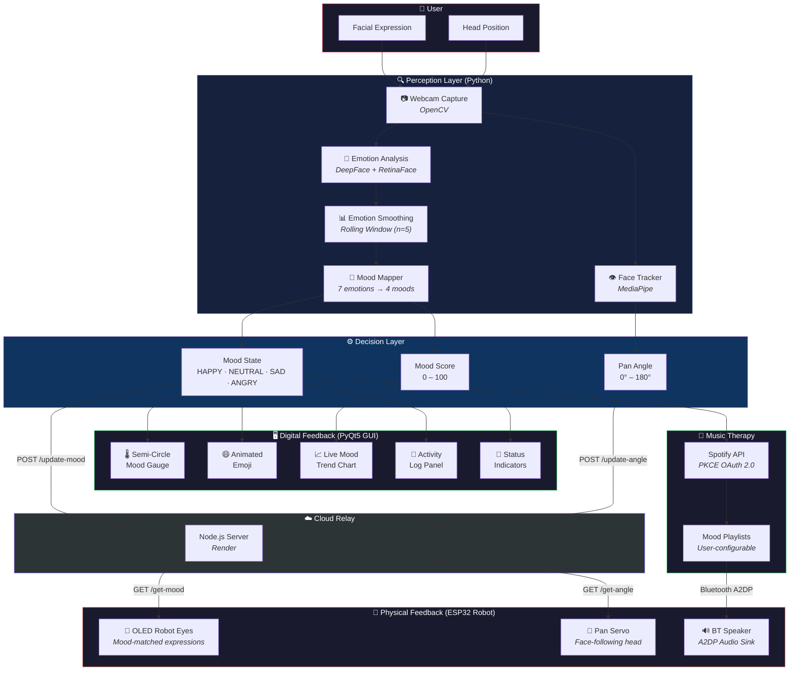

<](https://www.python.org/)
[](https://riverbankcomputing.com/software/pyqt/)
[](https://github.com/serengil/deepface)
[](https://www.espressif.com/)
[](https://developer.spotify.com/)
[]()

---

**Mood-Mate** is a multimodal, emotion-responsive companion robot built around **Human-Computer Interaction (HCI)** principles. It combines **real-time facial emotion recognition**, a **physical robotic embodiment** with expressive OLED eyes, a **servo-based face-tracking head**, a **Bluetooth speaker for mood-adaptive music**, and a polished **desktop GUI** — all working in concert to create a deeply personalized wellness experience.

[Overview](#-project-overview) · [Tech Stack](#-tech-stack) · [Architecture](#-hci-design--user-flow) · [Features](#-key-features--ux-principles) · [Setup](#-environment--installation-setup) · [Run](#-local-execution--testing)

</div>

---

## 📋 Project Overview

### The Vision

Mood-Mate addresses a critical gap in emotional wellness technology: most mood-tracking apps are **passive** — they ask users to self-report feelings. Mood-Mate flips this paradigm by **actively sensing** the user's emotional state through computer vision, then **responding** across multiple physical and digital channels simultaneously.

### Target Audience

| Audience | Use Case |
|---|---|
| **HCI Researchers** | A reference platform for studying embodied emotion-aware interfaces, multimodal feedback loops, and affective computing pipelines |
| **Wellness & Therapy Spaces** | Ambient companion that monitors emotional trends and provides non-intrusive music-based interventions |
| **Maker / IoT Enthusiasts** | A fully integrated ESP32 + Python + Cloud system demonstrating real-time hardware-software coordination |
| **Students & Educators** | A capstone-grade project showcasing DeepFace, PyQt5, servo control, OLED animation, and REST APIs in a single cohesive system |

### User-Centered Design Philosophy

Mood-Mate is grounded in established HCI principles:

- **🎯 Non-Intrusive Sensing** — Emotion detection runs passively via webcam; the user never needs to manually log a mood entry.
- **🔄 Continuous Feedback Loop** — Detected emotions are reflected back to the user through a rich desktop gauge, animated robot eyes, and curated music — closing the perception-action loop.
- **🧠 Affect-Aware Adaptation** — The system adapts its behavior (eye expression, music genre, head orientation) to the user's current emotional state, respecting the principle of *adaptive interfaces*.
- **♿ Graceful Degradation** — Hardware components (serial, Wi-Fi, ESP32, Spotify) are all optional. The system operates in a reduced-but-functional mode when any subsystem is unavailable.
- **🛡️ Permission-First Design** — Webcam access requires explicit user consent via a dialog prompt before any detection begins.

### Core Wellness Objectives

1. **Ambient Emotion Monitoring** — Continuously track facial emotions without requiring conscious user effort.
2. **Music-Based Mood Regulation** — Automatically play mood-matched Spotify playlists as a form of passive music therapy.
3. **Visual Trend Analytics** — Render real-time mood score charts so users can identify emotional patterns over time.
4. **Embodied Empathic Response** — Through animated OLED robot eyes that mirror the user's detected emotion, creating a sense of *social presence*.

---

## 🛠 Tech Stack

### Software Components

| Layer | Technology | Role |
|---|---|---|
| **Desktop UI / Frontend** | [PyQt5](https://riverbankcomputing.com/software/pyqt/) | Main GUI framework — semi-circle mood gauge, emoji animations, log panel, control buttons |
| **Emotion Recognition (ML)** | [DeepFace](https://github.com/serengil/deepface) (RetinaFace backend) | Real-time facial emotion analysis (7 emotions → 4 mood categories) |
| **Face Detection / Tracking** | [MediaPipe](https://mediapipe.dev/) Face Detection | Headless face tracking for servo-driven pan control |
| **Computer Vision** | [OpenCV](https://opencv.org/) (`cv2`) | Webcam capture, frame preprocessing (grayscale equalization) |
| **Data Visualization** | [Matplotlib](https://matplotlib.org/) (Qt5Agg backend) | Live mood-score time-series chart embedded in the GUI |
| **Music Integration** | [Spotify Web API](https://developer.spotify.com/documentation/web-api/) (PKCE OAuth 2.0) | Mood-adaptive playlist playback with full device management |
| **Relay Server** | [Node.js](https://nodejs.org/) + [Express](https://expressjs.com/) | Cloud-hosted REST relay bridging the Python app and ESP32 microcontrollers |
| **Serial Communication** | [PySerial](https://pyserial.readthedocs.io/) | Optional direct USB-serial link to ESP32 hardware |

### Hardware / Embedded Components

| Module | Microcontroller | Peripheral | Function |
|---|---|---|---|
| **Emotion Eyes** | ESP32 DevKit | SSD1306 128×64 OLED | Animated robot eyes ([FluxGarage RoboEyes](https://github.com/FluxGarage/RoboEyes)) that change expression based on detected mood |
| **Face Tracker** | ESP32 DevKit | SG90 Servo Motor | Pan-servo head that follows the user's face in real time |
| **Bluetooth Speaker** | ESP32 DevKit | MAX98357A I2S DAC | A2DP Bluetooth audio sink — the robot's built-in speaker for Spotify playback |

### Infrastructure

| Service | Purpose |
|---|---|
| [Render](https://render.com/) | Cloud hosting for the Node.js mood relay server (`mood-relay-server.onrender.com`) |
| WiFiManager (ESP32) | Captive portal for zero-config Wi-Fi provisioning on all ESP32 modules |

---

## 🔀 HCI Design & User Flow

The following diagram illustrates the complete interaction architecture — from user presence through emotion sensing, multimodal feedback, and adaptive response:



### Interaction Cycle (Step-by-Step)

1. **Presence Detection** — The webcam continuously captures frames at a configurable interval (default: every 15 seconds).
2. **Emotion Classification** — Each frame is analyzed by DeepFace using the RetinaFace detector, producing confidence scores across 7 emotions (`happy`, `sad`, `angry`, `neutral`, `fear`, `disgust`, `surprise`).
3. **Temporal Smoothing** — A sliding window of the last 5 emotion readings is averaged to reduce jitter and false spikes.
4. **Mood Mapping** — The dominant smoothed emotion is mapped to one of 4 mood categories with an associated score:

   | Detected Emotion | Mood Category | Score |
   |---|---|---|
   | `happy` | HAPPY | 100 |
   | `neutral`, `surprise` | NEUTRAL | 50 |
   | `sad`, `fear`, `disgust` | SAD | 20 |
   | `angry`, `contempt` | ANGRY | 10 |

5. **Multimodal Response** — The mood state is simultaneously dispatched to:
   - The **desktop GUI** (gauge needle animation, emoji update, chart data point, log entry)
   - The **cloud relay server** via HTTP POST, which the ESP32 modules poll
   - The **Spotify API** to trigger mood-matched playlist playback
   - Optionally, a **direct serial link** to an ESP32

---

## ✨ Key Features & UX Principles

### 🎭 Real-Time Facial Emotion Recognition

- **DeepFace** with **RetinaFace** backend for robust face detection across varying lighting conditions
- Preprocessing pipeline includes grayscale conversion and histogram equalization for improved accuracy
- 5-frame rolling average smoothing eliminates transient emotion spikes
- Maps 7 raw emotions to 4 actionable mood categories

### 🌡️ Interactive Semi-Circle Mood Gauge

- Custom `QPainter`-rendered semicircular arc with a 4-color conical gradient (Angry → Sad → Neutral → Happy)
- Animated needle with glow effects and smooth easing transitions
- Segment separators with emoji labels for quick visual parsing
- Inner circle with mood label and percentage readout

### 📈 Live Mood Analytics & Trend Visualization

- Embedded Matplotlib chart with time-series mood scores
- Automatic axis formatting with `HH:MM:SS` timestamps
- Rolling 120-point window to keep the chart readable
- Grid overlay for at-a-glance trend identification

### 🎵 Spotify Music Therapy Integration

- **PKCE OAuth 2.0** flow (no client secret required) for secure, user-authorized access
- Automatic device detection and activation
- Per-mood playlist mapping with an in-app configuration dialog that fetches the user's Spotify library
- Playback monitoring thread that re-enables emotion detection after a song finishes
- Currently-playing song display with artist info in the GUI

### 👀 Expressive Robot Eyes (ESP32 + OLED)

- **FluxGarage RoboEyes** library drives animated eye expressions on a 128×64 SSD1306 OLED
- Mood-specific animations:
  - **HAPPY** — Laughing animation, rapid blink, idle wander
  - **ANGRY** — Angry slant with horizontal flicker
  - **SAD** — Tired/droopy expression, slow blink
  - **NEUTRAL** — Line-style neutral expression, no flicker
  - **ROUND** — Default boot state, friendly round eyes
- WiFiManager captive portal for zero-config network provisioning

### 🔄 Face-Tracking Servo Head

- **MediaPipe** face detection running headlessly in a separate Python process
- Dead-zone filtering to prevent jitter when the face is roughly centered
- 7-frame moving average for smooth, stable servo commands
- Angle step limiting (0.6° per cycle) for natural head movement
- Automatic center-return after 1.2 seconds of no face detection
- ESP32 polls angle at 80ms intervals for responsive tracking

### 🔊 Bluetooth Speaker Module

- ESP32 configured as an **A2DP Bluetooth audio sink** named `ESP32_Mood_Speaker`
- **MAX98357A I2S DAC** for high-quality audio output
- Pairs directly with the host computer — Spotify audio routes through the robot's physical speaker

### ☁️ Cloud Relay Server

- Lightweight Express.js server deployed on Render
- Two independent data channels:
  - `/update-mood` + `/get-mood` — Mood state relay (Python → ESP32 Eyes)
  - `/update-angle` + `/get-angle` — Servo angle relay (Python → ESP32 Head)
- Stale-data protection: ESP32 modules ignore the first server response after boot
- CORS-enabled for flexible client integration

### ♿ Accessibility & Usability Considerations

| Principle | Implementation |
|---|---|
| **Progressive Disclosure** | The GUI surfaces only essential controls (Start, Stop, Exit, Spotify) with detailed logs hidden in a scrollable panel |
| **Graceful Degradation** | Serial, Wi-Fi, Spotify, and ESP32 modules are all independently optional — the app runs with any subset |
| **Explicit Consent** | Webcam access requires an affirmative dialog response before initialization |
| **Visual Redundancy** | Mood state is communicated through 4 simultaneous channels (gauge, emoji, text label, chart) to accommodate different cognitive preferences |
| **Dark Theme** | High-contrast dark UI (`#0f1112` background) reduces eye strain during extended use |
| **Animated Feedback** | Smooth needle easing and pulsing emoji provide reassuring visual confirmation that the system is active |

---

## 🔧 Environment & Installation Setup

### Prerequisites

| Requirement | Version | Notes |
|---|---|---|
| **Python** | 3.10+ | Required for DeepFace and PyQt5 compatibility |
| **pip** | Latest | Python package manager |
| **Webcam** | Any USB/integrated | Required for emotion detection |
| **Node.js** | 18+ | Only needed if self-hosting the relay server |
| **PlatformIO / Arduino IDE** | Latest | Only needed for flashing ESP32 firmware |
| **Spotify Account** | Free or Premium | Premium required for on-demand playback |

### 1. Clone the Repository

```bash
git clone https://github.com/Kivindu02/Mood-Mate-HCI.git
cd Mood-Mate-HCI
```

### 2. Create a Virtual Environment

```bash
# Windows
python -m venv venv
venv\Scripts\activate

# macOS / Linux
python3 -m venv venv
source venv/bin/activate
```

### 3. Install Python Dependencies

```bash
pip install -r requirements.txt
```

This installs:

| Package | Purpose |
|---|---|
| `numpy` | Numerical operations |
| `opencv-python` | Webcam capture and image processing |
| `mediapipe` | Face detection for the tracking module |
| `deepface` | Facial emotion recognition (downloads models on first run) |
| `PyQt5` | Desktop GUI framework |
| `matplotlib` | Live mood chart rendering |
| `requests` | HTTP communication with Spotify and relay server |
| `pyperclip` | Clipboard support for Spotify auth URL |
| `pyserial` | Optional serial communication with ESP32 |

### 4. Spotify Configuration (Optional)

The app uses **Spotify PKCE OAuth 2.0** and ships with a default client ID. To use your own:

1. Create an app at [Spotify Developer Dashboard](https://developer.spotify.com/dashboard)
2. Add `http://127.0.0.1:8888/callback` as a Redirect URI
3. Set the environment variable:
   ```bash
   set SPOTIFY_CLIENT_ID=your_client_id_here    # Windows
   export SPOTIFY_CLIENT_ID=your_client_id_here  # macOS/Linux
   ```

### 5. ESP32 Firmware (Optional — Hardware Only)

Each ESP32 module has its own firmware under `Codes - Microcontrollers/`:

| Module | Directory | Key Libraries |
|---|---|---|
| Emotion Eyes | `Emotion Eyes/` | `Adafruit_SSD1306`, `FluxGarage_RoboEyes`, `WiFiManager` |
| Face Tracker | `Face Tracker/` | `ESP32Servo`, `WiFiManager`, `WiFiClientSecure` |
| Bluetooth Speaker | `Blutooth Speaker/` | `BluetoothA2DPSink` |

Flash each using **PlatformIO** or the **Arduino IDE** with the ESP32 board package installed.

### 6. Relay Server (Optional — Self-Hosting)

The relay server is already deployed at `mood-relay-server.onrender.com`. To self-host:

```bash
cd "Node Server"
npm install express cors
node server.js
```

Then update `NODE_SERVER_URL` in `app.py` and `SERVER_URL` in the ESP32 firmware files.

---

## 🚀 Local Execution & Testing

### Launch the Application

```bash
python app.py
```

**What happens on launch:**

1. A **permission dialog** asks for webcam consent
2. The **face tracker** process starts in the background
3. The **Spotify controller** is initialized (not yet authenticated)
4. The **main GUI window** opens

### Using the GUI

| Button | Action |
|---|---|
| **Start Detection** | Opens the webcam and begins the emotion detection loop |
| **Stop Detection** | Halts detection, releases the webcam and serial port |
| **Login to Spotify** | Opens a browser for Spotify OAuth; button changes to ✅ on success |
| **Set Mood Playlists** | Fetches your Spotify playlists and lets you assign one per mood |
| **Exit** | Stops all processes and closes the application |

### Testing Individual Modules

#### Test the Face Tracker Independently

```bash
python face_tracker.py
```

This runs the MediaPipe face tracker in headless mode, sending servo angles to the relay server.

#### Test the Relay Server

```bash
# Health check
curl https://mood-relay-server.onrender.com/

# Simulate a mood update
curl -X POST https://mood-relay-server.onrender.com/update-mood \
     -H "Content-Type: application/json" \
     -d '{"mood": "HAPPY", "score": 100}'

# Fetch current mood (as ESP32 would)
curl https://mood-relay-server.onrender.com/get-mood
```

#### Test ESP32 Modules

After flashing firmware, each ESP32 creates a **Wi-Fi setup portal**:

1. Connect to the ESP32's AP (`ESP32-Mood-Setup` or `ESP32-Head-Setup`)
2. Configure your Wi-Fi credentials via the captive portal
3. The ESP32 begins polling the relay server automatically

### Verification Checklist

- [ ] `python app.py` launches without errors and displays the GUI
- [ ] Clicking **Start Detection** activates the webcam (green LED on)
- [ ] The mood gauge needle moves and the emoji updates after ~15 seconds
- [ ] The log panel shows `Emotion(avg): ... | Mood: ... | Score: ...` entries
- [ ] The chart plots mood scores over time
- [ ] **Login to Spotify** completes OAuth and shows ✅
- [ ] Assigning playlists via **Set Mood Playlists** works
- [ ] Music auto-plays when a mood with an assigned playlist is detected
- [ ] ESP32 Eyes reflect the correct mood expression
- [ ] ESP32 Head servo follows face position
- [ ] ESP32 Speaker plays Spotify audio over Bluetooth

---

## 📁 Project Structure

```
Mood-Mate-HCI/
├── app.py                          # Main application — GUI, emotion detection, Spotify, comms
├── face_tracker.py                 # Headless MediaPipe face tracker → servo angle relay
├── requirements.txt                # Python dependencies
├── playlists.json                  # Mood → Spotify playlist URI mapping
├── user_playlists.json             # User-configured playlist overrides
├── spotify_tokens.json             # Cached Spotify OAuth tokens (auto-generated)
├── spotify.png                     # Spotify logo icon for GUI button
├── MoodMate Robot - Corrected.pdf  # Project documentation / report
│
├── Node Server/
│   └── server.js                   # Express.js mood & angle relay server
│
└── Codes - Microcontrollers/
    ├── Emotion Eyes/
    │   └── main.cpp                # ESP32 OLED animated robot eyes firmware
    ├── Face Tracker/
    │   └── main.cpp                # ESP32 servo face-tracking head firmware
    └── Blutooth Speaker/
        └── main.cpp                # ESP32 Bluetooth A2DP audio sink firmware
```

---

## 🤝 Contributing

Contributions are welcome! Areas of particular interest:

- **Additional emotion models** — Integrate BERT-based text sentiment or voice tone analysis
- **Mobile companion app** — React Native or Flutter client consuming the relay server
- **Extended wellness features** — Journaling, breathing exercises triggered by sustained negative mood
- **Accessibility audits** — Screen reader compatibility, keyboard-only navigation
- **Multi-user support** — Face recognition to maintain per-user mood histories

---

## 📄 License

This project was developed as an academic research project in Human-Computer Interaction. Please contact the repository owner for licensing inquiries.

---

<div align="center">
<sub>Built with ❤️ for better human-computer emotional understanding</sub>
</div>
]]>
